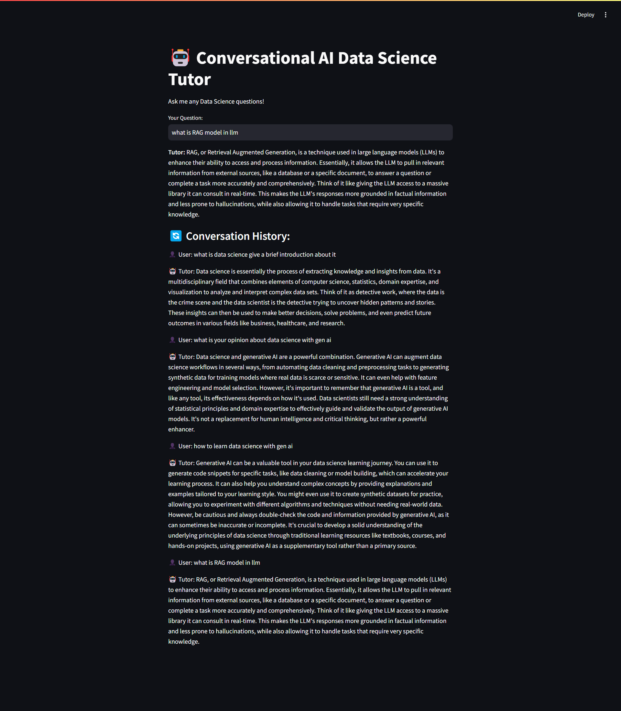

# Conversational AI Data Science Tutor



This is a **Conversational AI Data Science Tutor** built using:
- **Google Gemini 1.5 Pro**
- **LangChain Framework**
- **Streamlit UI**
- **Memory for conversation awareness**

## Features
✅ Answers only **data science-related** queries  
✅ **Conversation awareness** with memory storage  
✅ User-friendly **Streamlit-based UI**  

## Project Structure
```
📂 conversational-ai-tutor
 ┣ 📜 app.py               # Main application file
 ┣ 📜 requirements.txt      # Required dependencies
 ┣ 📜 README.md             # Project documentation
 ┣ 📜 test.png              # App preview image
```

## Installation Guide

### 1️⃣ Clone the Repository
```bash
git clone https://github.com/yourusername/conversational-ai-tutor.git
cd conversational-ai-tutor
```

### 2️⃣ Install Dependencies
Create a virtual environment (optional but recommended):
```bash
python -m venv venv
source venv/bin/activate  # On Windows use `venv\Scripts\activate`
```

Install the required dependencies:
```bash
pip install -r requirements.txt
```

### 3️⃣ Get Your Google Gemini API Key
1. Go to [Google AI Studio](https://aistudio.google.com/)
2. Sign in and create a new project
3. Enable the Gemini API
4. Get your API key and replace it in `app.py`:
```python
API_KEY = "your_api_key_here"
```

### 4️⃣ Run the Application
```bash
streamlit run app.py
```


## Screenshot


## License
This project is open-source and free to use!